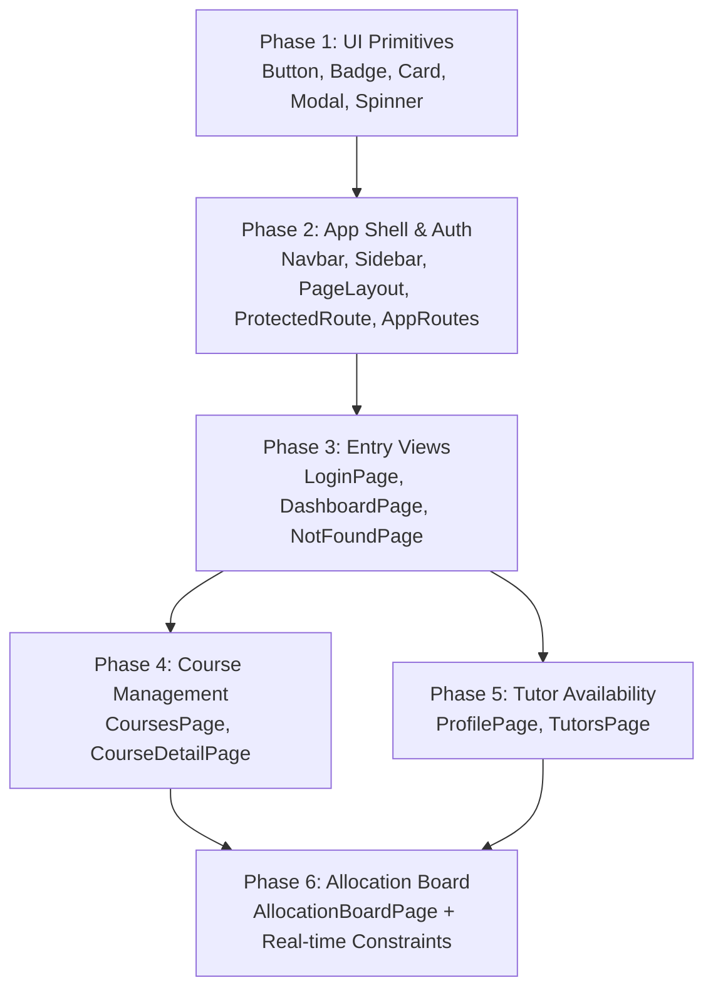

# 📘 Toodle Frontend Implementation Guide

### Developer Roadmap & Step-by-Step Feature Build Order

Welcome to the **Toodle Frontend Development Team**!  
This document outlines the step-by-step roadmap for building out the frontend Single Page Application (SPA). It explains **which components to build first**, **how features interconnect**, and **how to integrate with the pre-configured API client, Auth0 authentication, and utilities**.

---

## 🧭 Table of Contents

1. [Project Overview & Architecture](#1-project-overview--architecture)
2. [Quick Start for Developers](#2-quick-start-for-developers)
3. [Pre-Built Modules (Already Available)](#3-pre-built-modules-already-available)
4. [Step-by-Step Implementation Roadmap](#4-step-by-step-implementation-roadmap)
   - [Phase 1: Foundational UI Primitives](#phase-1-foundational-ui-primitives)
   - [Phase 2: Authentication & App Shell](#phase-2-authentication--app-shell)
   - [Phase 3: Public Landing & Dashboards](#phase-3-public-landing--dashboards)
   - [Phase 4: Course Management Views](#phase-4-course-management-views)
   - [Phase 5: Tutor Availability & Profile](#phase-5-tutor-availability--profile)
   - [Phase 6: The Core Feature — Allocation Board](#phase-6-the-core-feature--allocation-board)
5. [Connecting to the Backend API](#5-connecting-to-the-backend-api)
6. [Role-Based Access Control (RBAC) Guide](#6-role-based-access-control-rbac-guide)
7. [Git Workflow & Quality Checklist](#7-git-workflow--quality-checklist)

---

## 1. Project Overview & Architecture

`Toodle` is a responsive React 19 SPA for managing tutor course allocations at the Wits School of Computer Science and Applied Mathematics.

### System Roles

- 👑 **`ORGANISER`** (Staff/Course Coordinators): Full access to Course Management, Tutor Directory & Marks, and the **Allocation Board**.
- 🧑‍🏫 **`TUTOR`**: View assigned courses, set maximum hours, and manage weekly availability schedules.
- 🎓 **`STUDENT`**: Browse course directory and contact schedules.

### Tech Stack

- **Framework**: React 19 + Vite 6
- **Styling**: TailwindCSS v4 (CSS-first config in `src/styles/index.css`)
- **Icons**: `lucide-react`
- **Routing**: React Router v7
- **Authentication**: Auth0 React SDK (`@auth0/auth0-react`)
- **HTTP Client**: Axios with automatic Bearer token interceptor
- **Testing**: Vitest + React Testing Library

---

## 2. Quick Start for Developers

### Clone & Install

```bash
git clone https://sdp.ms.wits.ac.za/infinite-loopers/Toodle.git
cd Toodle
npm install
```

### Environment Configuration

Copy `.env.example` to `.env`:

```bash
cp .env.example .env
```

Ensure `.env` has:

```ini
VITE_API_URL=http://localhost:3000/api/v1
VITE_AUTH0_DOMAIN=...
VITE_AUTH0_CLIENT_ID=...
VITE_AUTH0_AUDIENCE=....
VITE_AUTH0_CALLBACK_URL=http://localhost:5173
```

### Start Development Server

```bash
npm run dev
```

Open [http://localhost:5173](http://localhost:5173) in your browser.

---

## 3. Pre-Built Modules (Already Available)

You do **not** need to recreate API clients or auth token handling — they are ready to import:

| Module              | Location                 | What It Provides                                                                                   |
| ------------------- | ------------------------ | -------------------------------------------------------------------------------------------------- |
| **API Client**      | `src/api/client.js`      | Configured Axios instance with Auth0 Bearer token interceptor.                                     |
| **Course API**      | `src/api/courses.js`     | `getCourses()`, `getCourse(id)`, `createCourse(data)`, `deleteCourse(id)`, `getCourseSessions(id)` |
| **Tutor API**       | `src/api/tutors.js`      | `getTutors()`, `getTutor(id)`, `addOrUpdateMark(id, data)`, `setAvailability(id, slots)`           |
| **Allocation API**  | `src/api/allocations.js` | `getAllocations()`, `createAllocation(data)`, `deleteAllocation(id)`, `validateAllocation(params)` |
| **User API**        | `src/api/users.js`       | `getCurrentUser()`, `syncUser(data)`, `updateUser(id, data)`                                       |
| **useAuth Hook**    | `src/hooks/useAuth.js`   | `{ user, role, isAuthenticated, isOrganiser, isTutor, isStudent, login, logout, getToken }`        |
| **useApi Hook**     | `src/hooks/useApi.js`    | `{ data, loading, error, refetch, execute } = useApi(apiFn)`                                       |
| **Helpers & Utils** | `src/utils/helpers.js`   | `cn()` (Tailwind merge), `formatTime()`, `formatDay()`, `getRoleBadgeStyle()`                      |
| **Constants**       | `src/utils/constants.js` | `ROLES`, `CONSTRAINT_TYPES`, `SESSION_TYPES`, `DAYS_OF_WEEK`                                       |

---

## 4. Step-by-Step Implementation Roadmap



---

### Phase 1: Foundational UI Primitives

> **Why first**: Every page and layout component depends on these standardized primitives.

| File                            | Responsibilities                                                                                          | Dependencies                 |
| ------------------------------- | --------------------------------------------------------------------------------------------------------- | ---------------------------- |
| `src/components/ui/Spinner.jsx` | Animated SVG/CSS loader (`sm`, `md`, `lg`).                                                               | `src/utils/helpers.js`       |
| `src/components/ui/Button.jsx`  | Variants (`primary`, `secondary`, `accent`, `danger`, `ghost`), loading states (`isLoading`), icon slots. | `Spinner.jsx`, `cn`          |
| `src/components/ui/Badge.jsx`   | Status chips for roles, staffing quota, and constraint warnings with optional dot indicator.              | `cn`                         |
| `src/components/ui/Card.jsx`    | Surface container with `CardHeader`, `CardBody`, `CardFooter`.                                            | `cn`                         |
| `src/components/ui/Modal.jsx`   | Accessible dialog using native HTML `<dialog>` with backdrop blur and escape key handler.                 | `Button.jsx`, `lucide-react` |

---

### Phase 2: Authentication & App Shell

> **Why second**: Establishes the layout frame, route guarding, and navigation for all protected pages.

| File                                     | Responsibilities                                                            | Dependencies                                  |
| ---------------------------------------- | --------------------------------------------------------------------------- | --------------------------------------------- |
| `src/components/auth/LoginButton.jsx`    | Triggers `useAuth().login()`.                                               | `Button.jsx`, `useAuth.js`                    |
| `src/components/auth/LogoutButton.jsx`   | Triggers `useAuth().logout()`.                                              | `Button.jsx`, `useAuth.js`                    |
| `src/components/auth/ProtectedRoute.jsx` | Checks `isAuthenticated`; redirects unauthenticated users to `/login`.      | `Spinner.jsx`, `useAuth.js`                   |
| `src/components/auth/RoleGate.jsx`       | Restricts components/routes by role (`allowedRoles={[ROLES.ORGANISER]}`).   | `useAuth.js`                                  |
| `src/components/layout/Navbar.jsx`       | Top header with logo, user profile avatar, role badge, and logout.          | `Badge.jsx`, `LogoutButton.jsx`, `useAuth.js` |
| `src/components/layout/Sidebar.jsx`      | Role-filtered side menu (Organiser vs. Tutor vs. Student).                  | `useAuth.js`, `lucide-react`                  |
| `src/components/layout/Footer.jsx`       | University attribution footer.                                              | None                                          |
| `src/components/layout/PageLayout.jsx`   | Composes `Navbar` + `Sidebar` + `<Outlet />` + `Footer`.                    | `Navbar`, `Sidebar`, `Footer`                 |
| `src/routes/AppRoutes.jsx`               | Configures React Router route tree and protected route hierarchy.           | `ProtectedRoute`, `RoleGate`, `PageLayout`    |
| `src/App.jsx`                            | Wraps app in `Auth0Provider`, `BrowserRouter`, and renders `<AppRoutes />`. | `AppRoutes.jsx`                               |

---

### Phase 3: Public Landing & Dashboards

> **Why third**: Creates the core landing points for all three roles upon login.

| File                          | Responsibilities                                                                         | Dependencies                                        |
| ----------------------------- | ---------------------------------------------------------------------------------------- | --------------------------------------------------- |
| `src/pages/LoginPage.jsx`     | Welcome banner, university branding, login trigger, and auth error display.              | `LoginButton.jsx`, `Card.jsx`                       |
| `src/pages/DashboardPage.jsx` | Role-tailored home screen: Organiser metrics, Tutor schedule/hours, Student course list. | `Card.jsx`, `Badge.jsx`, `Button.jsx`, `useAuth.js` |
| `src/pages/NotFoundPage.jsx`  | 404 error page with button to return to dashboard.                                       | `Button.jsx`                                        |

---

### Phase 4: Course Management Views

> **Why fourth**: Manages the course data and session times that the Allocation Board will assign tutors to.

| File                             | Responsibilities                                                                                       | Dependencies                                        |
| -------------------------------- | ------------------------------------------------------------------------------------------------------ | --------------------------------------------------- |
| `src/pages/CoursesPage.jsx`      | Searchable course catalog, staffing progress (e.g. 3/4 tutors), and "Add Course" modal for Organisers. | `coursesApi`, `Card.jsx`, `Modal.jsx`, `Button.jsx` |
| `src/pages/CourseDetailPage.jsx` | Scheduled sessions (days, times, venues), assigned tutors, prerequisite minimum mark requirements.     | `coursesApi`, `Card.jsx`, `Badge.jsx`               |

---

### Phase 5: Tutor Availability & Profile

> **Why fifth**: Manages tutor marks and weekly time slots needed by the constraint checker.

| File                        | Responsibilities                                                                                            | Dependencies                          |
| --------------------------- | ----------------------------------------------------------------------------------------------------------- | ------------------------------------- |
| `src/pages/TutorsPage.jsx`  | Organiser view: lists all tutors, historical course marks, allocated vs. max hours.                         | `tutorsApi`, `Card.jsx`, `Badge.jsx`  |
| `src/pages/ProfilePage.jsx` | Tutor self-service view: max weekly hours setting and **interactive weekly availability matrix** (Mon–Fri). | `tutorsApi`, `Card.jsx`, `Button.jsx` |

---

### Phase 6: The Core Feature — Allocation Board

> **The heart of Sprint 1**: The Organiser's single-board workspace for staffing courses with real-time constraint validation.

#### File: `src/pages/AllocationBoardPage.jsx`

#### Layout Structure:

1. **Left Panel (Tutor Pool)**:
   - Lists candidate tutors with remaining weekly hour dots (e.g. 6/10 hrs free).
   - Displays prerequisite marks for each course.
2. **Main Area (Course Columns)**:
   - One column per course showing staffing status (e.g. `2/4 Tutors Assigned`).
   - Cards showing assigned tutors with live constraint badges.
   - "Assign Tutor" action button per column.

#### Real-Time Constraint Validation Rules:

Before and after an assignment is placed, validate the 3 core constraints:

```javascript
// 1. Mark Prerequisite Check
if (tutorMark < course.minMarkRequired) {
  // Flag: MARK_BELOW_THRESHOLD (Severity: 'error')
  // Message: `Mark is ${tutorMark}% (Requires ≥ ${course.minMarkRequired}%)`
}

// 2. Timetable Clash Check
if (tutor.busySlots.includes(course.sessionTime)) {
  // Flag: TIMETABLE_CLASH (Severity: 'error')
  // Message: `Clashes with course contact session (${course.sessionTime})`
}

// 3. Weekly Hours Limit Check
if (tutor.allocatedHours + sessionHours > tutor.maxHours) {
  // Flag: HOURS_EXCEEDED (Severity: 'warning')
  // Message: `Exceeds weekly budget (${tutor.allocatedHours}/${tutor.maxHours}h)`
}
```

---

## 5. Connecting to the Backend API

### Using the Pre-written API Functions

All endpoints in `src/api/` are asynchronous and handle authentication tokens automatically.

```javascript
import { coursesApi } from '../api/courses';
import { allocationsApi } from '../api/allocations';

// Example: Fetching courses
const fetchCourses = async () => {
  try {
    const data = await coursesApi.getCourses();
    console.log('Courses:', data);
  } catch (error) {
    console.error('Failed to load courses:', error.response?.data?.message || error.message);
  }
};
```

### Using the `useApi` Custom Hook

For declarative data fetching with loading and error states:

```javascript
import useApi from '../hooks/useApi';
import { coursesApi } from '../api/courses';

export default function CoursesList() {
  const { data: courses, loading, error, refetch } = useApi(coursesApi.getCourses);

  if (loading) return <Spinner />;
  if (error) return <p className="text-rose-600">Error: {error}</p>;

  return (
    <div>
      {courses.map((course) => (
        <Card key={course.id}>{course.name}</Card>
      ))}
    </div>
  );
}
```

---

## 6. Role-Based Access Control (RBAC) Guide

Use the `useAuth()` hook to check permissions in any component:

```javascript
import useAuth from '../hooks/useAuth';
import { ROLES } from '../utils/constants';

export default function CourseActions({ courseId }) {
  const { isOrganiser, isTutor, hasRole } = useAuth();

  return (
    <div>
      {/* Visible only to Organisers */}
      {isOrganiser && <Button variant="danger">Delete Course</Button>}

      {/* Visible to Tutors and Organisers */}
      {hasRole([ROLES.ORGANISER, ROLES.TUTOR]) && <Button>View Roster</Button>}
    </div>
  );
}
```

---

## 7. Git Workflow & Quality Checklist

### Branching Convention

Create a branch for your task:

```bash
git checkout -b feature/short-description
```

### Commit Message Standard (Conventional Commits)

- `feat: add interactive availability matrix on ProfilePage`
- `fix: resolve timetable clash badge color in AllocationBoard`
- `test: add unit test for constraint validator helper`

### Pre-Push Verification Checklist

Before pushing your branch, run:

```bash
npm run lint    # Must report 0 errors
npm test        # All Vitest unit tests must pass
npm run build   # Vite build must succeed
```

### Pushing Code

```bash
git push origin feature/short-description
```

_(Pushing to `origin` automatically syncs with both Wits Gitea for grading and GitHub for Vercel deployment)._

---

### 💡 Questions or Need Help?

- Check the detailed comments and JSDoc annotations at the top of each file in `src/`.
- Refer to `src/utils/constants.js` for role names and constraint types.
